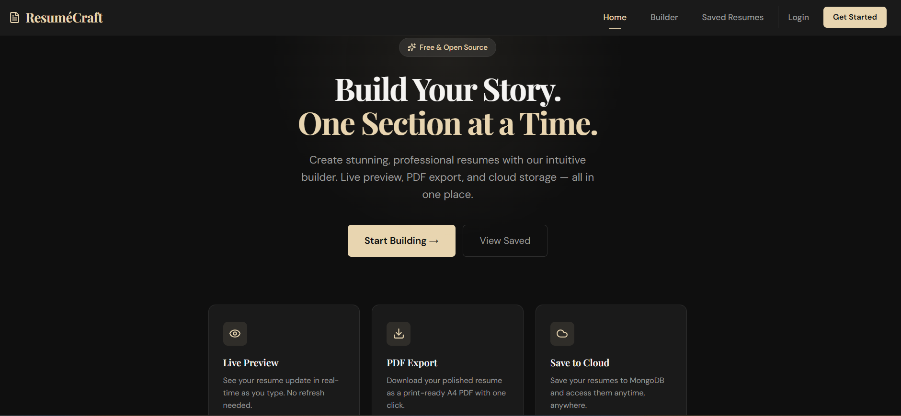
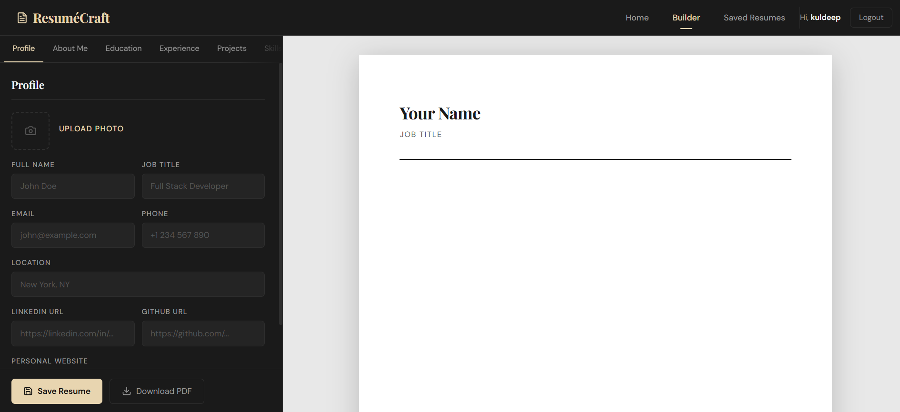

# 📄 ResuméCraft — Dynamic Resume Builder

<div align="center">


[](https://resume-craft-steel.vercel.app/)
[](https://github.com/KuldeepShivajiraoGheghate/Resume_Craft)
[](https://github.com/KuldeepShivajiraoGheghate/Resume_Craft)

> **Build Your Story. One Section at a Time.**  
> A full-stack MERN web application to create, preview, and download professional resumes — live, in real time.

</div>

---

## 🖼️ Screenshots

| 🏠 Homepage | 🔐 Auth |
|---|---|
|  |  |

| ✏️ Builder | 📁 Saved |
|---|---|
|  |  |

---

## ✨ Features

- 🔴 **Live Resume Preview** — Resume updates in real-time as you type. No submit, no reload.
- 📝 **7 Customizable Sections** — Profile, About Me, Education, Experience, Projects, Skills, and Custom Sections
- 📥 **PDF Export** — Download your resume as a print-ready A4 PDF with one click (powered by `html2pdf.js`)
- ☁️ **Cloud Save** — Save resumes to MongoDB and access them anytime from your dashboard
- 🔐 **User Authentication** — Sign up / Login with JWT-based authentication
- 📋 **Saved Resumes Dashboard** — Load a previous resume back into the builder, or delete it
- 🖼️ **Profile Photo Upload** — Upload and embed your photo directly in the resume
- 🎨 **Elegant UI** — Dark editorial design with Playfair Display typography and warm gold accents
- 📱 **Responsive Layout** — Works on desktop and mobile

---

## 🛠️ Tech Stack

### Frontend
| Technology | Purpose |
|---|---|
| ⚛️ React.js (Vite) | UI framework |
| 🎨 TailwindCSS | Styling |
| 🎞️ Framer Motion | Animations & transitions |
| 📄 html2pdf.js | PDF generation |
| 🔗 Axios | API calls |
| 🧭 React Router DOM | Client-side routing |

### Backend
| Technology | Purpose |
|---|---|
| 🟢 Node.js | Runtime |
| ⚡ Express.js | REST API server |
| 🍃 MongoDB | Database |
| 🔷 Mongoose | ODM for MongoDB |
| 🔑 JWT | Authentication tokens |
| 🔒 bcrypt | Password hashing |

### Deployment
| Service | Usage |
|---|---|
| ▲ Vercel | Frontend hosting |
| 🍃 MongoDB Atlas | Cloud database |

---

## 📁 Project Structure

```
resume-builder/
├── client/                        # React frontend (Vite)
│   ├── src/
│   │   ├── components/
│   │   │   ├── form/              # All section forms (Profile, Education, etc.)
│   │   │   ├── preview/           # Live resume preview component
│   │   │   └── ui/                # Navbar, Buttons, Input fields
│   │   ├── context/
│   │   │   └── ResumeContext.jsx  # Global state (live updates)
│   │   ├── hooks/
│   │   │   └── useResumeData.js   # API interaction hooks
│   │   ├── pages/
│   │   │   ├── Home.jsx
│   │   │   ├── Builder.jsx
│   │   │   └── SavedResumes.jsx
│   │   └── utils/
│   │       └── downloadPDF.js     # html2pdf export utility
│
├── server/                        # Node/Express backend
│   ├── config/
│   │   └── db.js                  # MongoDB connection
│   ├── controllers/
│   │   └── resumeController.js    # CRUD logic
│   ├── models/
│   │   └── Resume.js              # Mongoose schema
│   ├── routes/
│   │   └── resumeRoutes.js        # API endpoints
│   ├── middleware/
│   │   └── errorHandler.js
│   └── index.js                   # Express server entry point
│
├── .gitignore
└── README.md
```

---

## 🚀 Getting Started

### Prerequisites
Make sure you have the following installed:
- [Node.js](https://nodejs.org/) v18+
- [MongoDB](https://www.mongodb.com/) (local) or a [MongoDB Atlas](https://cloud.mongodb.com/) account
- npm or yarn

### 1️⃣ Clone the Repository

```bash
git clone https://github.com/KuldeepShivajiraoGheghate/Resume_Craft.git
cd Resume_Craft
```

### 2️⃣ Setup the Backend

```bash
cd server
npm install
```

Create a `.env` file inside the `server/` directory:

```env
MONGO_URI=mongodb+srv://<username>:<password>@cluster.mongodb.net/resumebuilder
PORT=5000
JWT_SECRET=your_jwt_secret_key
```

Start the backend server:

```bash
npm run dev
# Server runs on http://localhost:5000
```

### 3️⃣ Setup the Frontend

```bash
cd ../client
npm install
npm run dev
# App runs on http://localhost:5173
```

### 4️⃣ Open in Browser

```
http://localhost:5173
```

---

## 🔌 API Endpoints

### Resume Routes — `/api/resumes`

| Method | Endpoint | Description |
|---|---|---|
| `POST` | `/api/resumes` | Create and save a new resume |
| `GET` | `/api/resumes` | Get all saved resumes |
| `GET` | `/api/resumes/:id` | Get a single resume by ID |
| `PUT` | `/api/resumes/:id` | Update an existing resume |
| `DELETE` | `/api/resumes/:id` | Delete a resume |

### Auth Routes — `/api/auth`

| Method | Endpoint | Description |
|---|---|---|
| `POST` | `/api/auth/register` | Register a new user |
| `POST` | `/api/auth/login` | Login and receive JWT token |

---

## 📋 Resume Sections

Each section is managed independently in the builder:

| # | Section | Fields |
|---|---|---|
| 1 | 👤 **Profile** | Name, Title, Email, Phone, Location, LinkedIn, GitHub, Website, Photo |
| 2 | 💬 **About Me** | Professional summary / bio |
| 3 | 🎓 **Education** | Institution, Degree, Field, Year, Grade (multiple entries) |
| 4 | 💼 **Experience** | Company, Role, Dates, Description (multiple entries) |
| 5 | 🚀 **Projects** | Title, Description, Tech Stack, Live Link, GitHub Link |
| 6 | 🧠 **Skills** | Technical, Soft Skills, Languages, Tools (tag-based input) |
| 7 | ➕ **Custom Section** | Custom heading + free-text content |

---

## 📄 PDF Export

The PDF is generated client-side using `html2pdf.js` with the following settings for best quality:

- **Format**: A4 Portrait
- **Scale**: 2x (high-DPI, sharp on print)
- **Margins**: 10mm all sides
- **Image Quality**: 98%
- **Page Breaks**: Intelligent — avoids splitting entries mid-page

---

## 🎨 Design System

| Property | Value |
|---|---|
| **Primary Font** | Playfair Display (headings) |
| **Body Font** | DM Sans |
| **Background** | `#0f0f0f` (near black) |
| **Surface** | `#1a1a1a` |
| **Accent Color** | `#e8d5b0` (warm gold) |
| **Resume Background** | `#ffffff` (clean white) |
| **Theme** | Dark editorial, refined minimal |

---

## 🌐 Deployment

### Frontend (Vercel)
The `client/` folder is deployed on Vercel.

- Push to `main` branch → Vercel auto-deploys
- Set environment variable `VITE_API_URL` to your backend URL in Vercel dashboard

### Backend (Render / Railway / Vercel Serverless)
The `server/` folder can be deployed on [Render](https://render.com) or [Railway](https://railway.app):

- Set environment variables: `MONGO_URI`, `PORT`, `JWT_SECRET`
- Start command: `node index.js`

---

## 🔮 Future Improvements

- [ ] 🖼️ Multiple resume templates (Classic, Modern, Minimal)
- [ ] 🔃 Drag-and-drop section reordering
- [ ] 📊 ATS Score Indicator (keyword analysis)
- [ ] 🎨 Resume accent color picker
- [ ] 💾 Auto-save to localStorage (debounced)
- [ ] 🔗 Shareable public resume link (`/view/:id`)
- [ ] 📧 Email resume as PDF attachment
- [ ] 🌐 Multi-language support

---

## 👨‍💻 Author

**Kuldeep Shivajirao Gheghate**

[](https://github.com/KuldeepShivajiraoGheghate)

> Computer Engineering undergraduate at PCCOE, specializing in AWS cloud infrastructure, serverless architecture, and full-stack development.

---

## 📜 License

This project is open source and available under the [MIT License](LICENSE).

---

<div align="center">

⭐ **If you found this project helpful, please give it a star!** ⭐

Made with ❤️ by Kuldeep Gheghate

</div>
